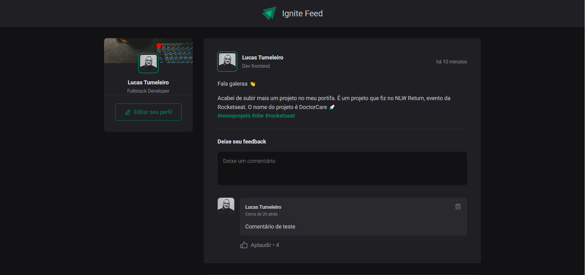
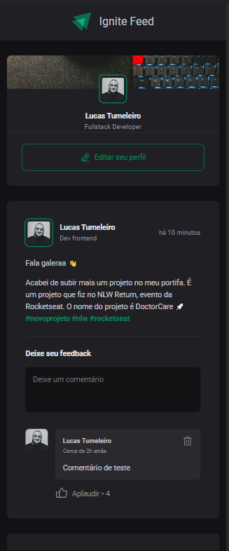

# Ignite Rocketseat: Ignite Feed

<br/>

## Layout:

<h3 align="center">Desktop</h3>
<div align="center">
  
</div>

<br/>

<h3 align="center">Mobile</h3>
<div align="center">
  
</div>

<br/>
<br/>

## Tecnologias utilizadas

-   ReactJS
-   Javascript
-   CSS
-   HTML
-   Typescript
-   Vite
-   Date-fns
-   phosphor Icons

<br/>
<br/>

## Getting started

Clone o projeto e acesse a pasta

```bash
$ git clone https://github.com/lucastumeleiro/Ignite-Feed.git
$ cd
```

Siga os passos:

```bash
# Instale as dependências
$ yarn
# Inicie o projeto
$ yarn start
#O projeto pode ser acessado em: http://localhost:3000
```

## Deploy

<p align="center"> Para visualização e teste da aplicação, foi realizado o deploy utilizado Vercel</p>
<p>Link para acessa-lo: <a href="link">link</a></p>

<br/>
<br/>
